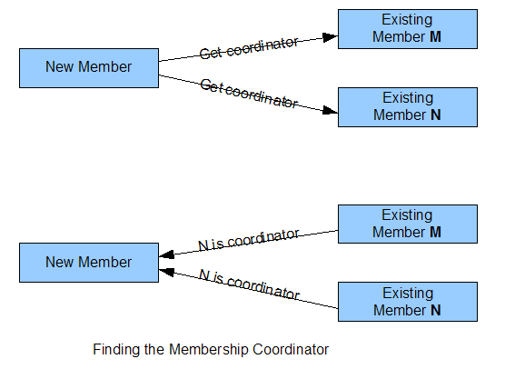
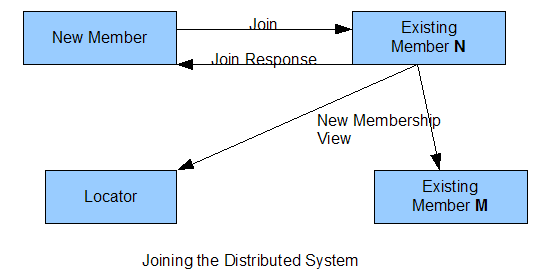

The Geode distributed system is made up of a number of member caches that connect to each other in a peer-to-peer (P2P) network. In this topology, each peer maintains communication channels to every other peer, allowing for one network hop access to any other cache member. Even though Geode clients (that can host their own local cache) only connect to specific servers, all servers in a Geode distributed system are always aware of and connected to each other.

#Dynamic Group Membership Service (GMS)

A static distributed membership system, where the member caches are well defined (their identity and where they will be hosted) is inflexible and makes it difficult to add or remove members dynamically. The system would have to shutdown partially or completely to expand or contract the number of members participating in the distributed system in response to changing load.

Instead, Geode's dynamic model uses a concept of system membership that is self-defined, allowing members to be added or removed in a very short time scale compared to static systems. The GMS allows processes to join or leave the system at any time and it communicates these membership events to every other member in the system.

## Discovery

Any peer member (either a application hosting a peer cache or a CacheServer) announces itself to the distributed system through one of two mechanisms:

* Geode locator: This is a component that maintains a discovery set of all peer members in the distributed system at any given moment. Though typically started as a separate process (with redundancy), locators can also be embedded in any peer cache (like a CacheServer). New members contact the locator via a TCP port to get the current set of peer members. These members are then asked who the current membership coordinator is. Locators are neither a bottleneck to cache operations nor a single point of failure.

* Multicast based discovery: As an alternative to locators, members can use a multicast channel to find the membership coordinator and join the distributed system. Multicast is not enabled in all networks, particularly small, home-based networks.

The membership coordinator is usually the oldest member in the distributed system and is responsible for ensuring that all members know about changes in membership. If the membership coordinator fails, the GMS automatically selects the next-oldest member to function as the coordinator. 

## Joining

Once a new process has discovered the membership coordinator's identity, it sends the coordinator a join-request. The coordinator responds by adding the process's identity to the membership set (called a membership view) and sending the updated set to the new process and to all of the existing members.

When the new process receives the join-response, it forms network connections to the other members and exchanges configuration information. The network connections are TCP/IP stream-socket 
connections unless the Geode disable-tcp property has been set to disable 
use of stream-sockets for this purpose.

The exchange of configuration information allows existing members to ensure 
that the new process is using the same version of Geode and has compatible 
licensing and communication settings. If the new process, for instance, is 
using a license meant for testing or development and it attempts to join a 
distributed system that is using a production license, the members of the 
distributed system will reject the new process. The new process will then 
send a leave-request to the coordinator and close its cache.

## Surprise Members

One of the guiding principles in the design of Geode's distributed algorithms
is that nothing is instantaneous.  For instance, when a new process is joining
the distributed system, it may receive its join-response from the membership
coordinator and commence configuration exchange (described below) before other
members know of its existence.  When this happens, the other members announce
the new process as a surprise member and allow the configuration exchange.  The
new process remains designated as a surprise member until the new membership
view is finally received.  If this doesn't happen within 30 seconds (6 *
member-timeout setting), the surprise member is rejected and communication with
it is terminated.

## Cache Formation

Once a new member has joined the distributed system, it begins constructing 
its cache regions. Cache region formation also entails configuration exchange 
with other members of the distributed system to ensure that the new member is 
using compatible settings, and to initiate the flow of events for the region 
to the new member. This may also include using a non-blocking state-flush 
algorithm to ensure that the new member's region has consistent state with 
other members. The distributed state-flush algorithm essentially places 
markers in communication channels that are used to trigger correct transfer 
of current state of the region to the new member. Using these markers allows 
the state-flush process to proceed without blocking reads or updates that are 
occurring on the existing members.

So, the steps of forming a cache region are

1. exchange region configuration information with other members
    
2. begin accepting and applying distributed events (created, updates, invalidations, deletions) to the new region
    
3. if the region's data-policy is REPLICATE or PRELOADED, perform the state-flush algorithm and copy the current state of the region to the new member

Partitioned regions also use the state-flush algorithm to ensure consistency when satisfying redundancy requirements.

Since the current state of the region may be quite large and take time to transfer, Geode is careful to not overwrite more recent changes that have been received while this is happening.

## Process when a member cache departs normally

When a member leaves the distributed system, it flushes its communication channels to other members and then sends them messages that it is stopping cache operations. The communication channels must be flushed to ensure that all messages have been read by their recipients. The other members receive the stopping message and update their cache region meta information and cease distributing changes to the departing member. The member then sends a leave-request to the membership coordinator, which responds by sending a new membership view to all members of the distributed system. Those members then close communication channels to the departing member and add its identity to a shun set to disallow further communications with it.

If Geode locators are being used for discovery, they will eventually remove the departed member from the discovery set. This is done asynchronously in order to reduce load on the locator process.

## Process when a member cache departs abnormally

Geode uses a combination of TCP/IP stream-socket connections and UDP datagram heartbeats to detect abnormal termination of members. Each member selects one other member of the system to monitor. That member is expected to send periodic datagram heartbeats to its monitoring process. If a heartbeat is missed within twice the member-timeout Geode setting (which defaults to 5000 milliseconds), the product attempts to form a TCP/IP stream-socket connection to the monitored process. If that fails, a suspect message is distributed to all members.

When members receive suspect notification, they send an are you alive datagram message to the suspected member. If a response isn't received within the member-timeout interval, the membership coordinator sends out a new membership view that notes the failure. Members that receive this notification close communication channels to the crashed member and remove it from their cache meta data. If the member that died happened to be the current membership coordinator, the next oldest process picks up the role and sends out the new membership view.

A sick member, or one that is consuming too much CPU to respond to are you alive messages, may be kicked out while still being more or less alive. When that happens, the member's cache will shut down and a ForcedDisconnectException alert is issued to any attached applications.

## Handling network partition (aka Split brain)

When there is network segmentation, a distributed system that doesn't handle the condition properly will allow multiple subgroups to form. This can lead to numerous problems including distributed applications operating on inconsistent data. For instance, since clients connecting to a server cluster are not tied into the membership system, a client might communicate with servers from multiple subgroups. Or, one set of clients might see one subgroup of servers while another set of clients cannot see that subgroup but can see another one.

Geode handles this problem by only allowing one subgroup to form and survive. The distributed systems and caches of other subgroups are shut down as quickly as possible. Appropriate alerts are raised through the Geode logging system to alert administrators to take action.

Network partition detection in Geode is based on Quorum.  Each member is given a certain weight: 3 for a non-colocated locator, 10 for other members, 5 extra for the lead member.  A single change in membership cannot lose 51% or more of the weight of the last membership set.

Each member is responsible for detecting a network partition.  Usually this happens quickly, with one of the members on the losing partition determining that the old membership coordinator is gone
and that it should elect itself membership coordinator.  Once it does this and sends a new membership view it discovers, through a 2-phase view commit, the other missing members and sends a network parition 
message to the processes on the losing side.

### Auto-reconnect

Geode also has an auto-reconnect mechanism that is useful in Locators and
caches with persistent storage or sufficient redundancy that they can recover
cache data after a network partition is corrected.

Auto-reconnect dismantles the current Cache and DistributedSystem and creates
a background thread that periodically tries to rejoin the old system.  If
successful in doing so it recreates the cache based either on Shared
Configuration (if enabled) or using XML generated from the old cache.

Disconnected members also create a background Quorum Responder thread that
allows others to contact them.  This is used in multicast clusters to let 
disconnected members discover a quorum of members (whether disconnected or 
not) and proceed to rejoin the system.  It is also used by Locators to allow 
them to boot their location services and service discovery requests.

### Enabling network partition detection

Network partition detection is enabled by setting the enable-network-partition-detection 
DistributedSystem property to true. This should be done in all Locators and in 
any other process that you wish to be sensitive to network partitioning.

## Dealing with slow or sick members

If a member is slow to respond it can drag down the whole distributed system. 
A sick member, perhaps an application that is low on memory and is constantly 
running garbage-collection, can have the same effect. Geode has three 
mechanisms for dealing with this problem:

* The *ack-wait-threshold* distributed system property specifies how long Geode will wait for a response to a message before issuing a warning alert. It defaults to 15 seconds. If many of these warning alerts are being issued for the same process, something may be wrong with that process. You may want to examine the statistics for the process to see if it has enough free memory, or force a series of thread-dumps to see if threads are behaving as expected.

* The *ack-severe-alert* distributed system property specifies an additional period of time past the ack-wait-threshold that Geode will wait before issuing a severe-level alert. This property defaults to zero seconds, which disables the feature. Enabling it also causes suspect processing to be initiated when the ack-wait-threshold elapses.

* For *distributed-no-ack* distribution scopes (where cache events are transmitted to other members w/o requiring a reply), the property async-distribution-timeout can be set to force queuing of messages for a slow receiver. If a write operation blocks for async-distribution-timeout milliseconds, Geode will commence queuing events for the slow receiver until it catches up. The property async-queue-timeout can also be set to a number of milliseconds allowed for the slow receiver to catch up, or the property async-max-queue-size can be set to limit the number of messages queued for a slow receiver. If either async-queue-timeout or async-max-queue-size is reached, the slow receiver is kicked out of the distributed system.

