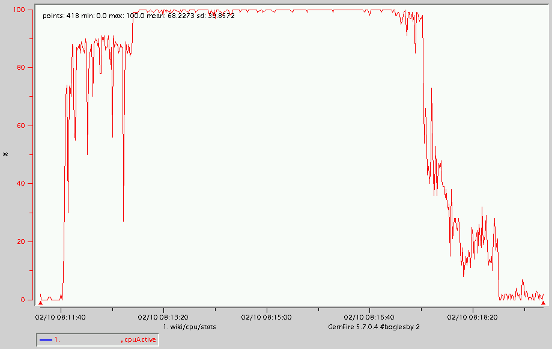
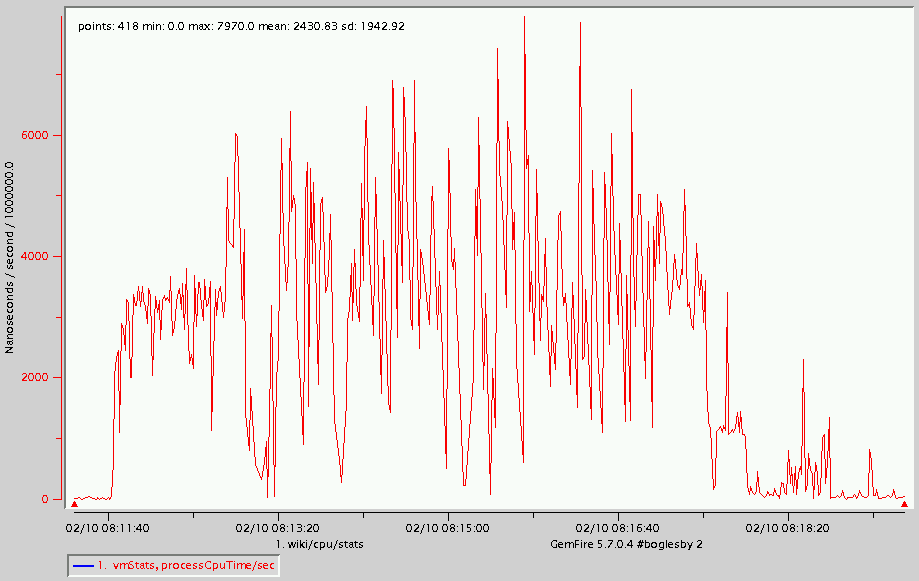

# Troubleshooting CPU
## Description
When an application becomes CPU-bound, it no longer processes interrupts efficiently.
## Determination
One way to determine whether a machine or process is CPU-bound is to use an operating system command such as *vmstat* or *top* while the application is running.

###Operating System Command
####vmstat
The *vmstat* output below shows that the CPUs are 99% idle.

	vmstat 2
	 procs                      memory      swap          io     system         cpu
	  r  b   swpd   free   buff  cache   si   so    bi    bo   in    cs us sy id wa
	  2  0  95592  61288 975548 329124    1    2    23    24  178   623  3  1 93  3
	  0  0  95592  61288 975548 329124    0    0     0     0  177   577  1  0 98  0
	  0  0  95592  61288 975552 329124    0    0     0    16  172   583  1  0 98  0
	  0  0  95592  61284 975552 329124    0    0     0     0  173   585  0  1 99  0
	  0  0  95592  61280 975556 329124    0    0     0     6  173   569  0  0 99  0
####top
The *top* output shows, among other things, CPU usage percentage. The output below shows that the CPUs are mostly in use (idle=3.0%) and that Java processes using most of that CPU.

	top
	  12:49:24  up 113 days, 23:36, 35 users,  load average: 10.40, 5.20, 2.30
	 615 processes: 587 sleeping, 27 running, 1 zombie, 0 stopped
	 CPU states:  cpu    user    nice  system    irq  softirq  iowait    idle
	            total   61.7%    0.0%   31.4%   0.5%     2.5%    0.4%    3.0%
	 
	   PID USER  PRI  NI  SIZE  RSS SHARE STAT %CPU %MEM   TIME CPU COMMAND
	 22523 user1  15   0 1102M 1.1G 18068 R     3.6 14.1   0:24   1 java
	 22778 user1  15   0 1102M 1.1G 18068 R     2.1 14.1   0:02   1 java
	 22682 user1  15   0 1102M 1.1G 18068 R     1.4 14.1   0:07   1 java
	 22698 user1  15   0 1102M 1.1G 18068 R     1.4 14.1   0:10   0 java
	 19286 user1  15   0 1100M 1.1G 18080 R     0.5 14.1   0:25   0 java
###vsd
Another way to determine whether a machine or process is CPU-bound is to use *vsd* to display active CPU and process CPU time values contained in a given GemFire statistics archive. The *LinuxProcessStats* category contains the active CPU statistic, and the *VMStats* category contains the process CPU time statistic.
####LinuxSystemStats
The *vsd* chart below shows *LinuxSystemStats cpuActive* values contained in a given GemFire statistics archive. This process is CPU-bound.

####VMStats
The vsd chart below shows VMStats processCpuTime value contained in a given GemFire statistics archive.

###gfsh
The *gfsh show metrics* command can be used to show the cpuUsage of a member. An example is:

	show metrics --member=server1 --categories=member
	
	Member Metrics
	
	Category |     Metric      | Value
	-------- | --------------- | -----------------
	member   | upTime          | 14
	         | cpuUsage        | 84.13760375976562
	         | currentHeapSize | 2200
	         | maximumHeapSize | 81250

##Action
Determining that there is a CPU issue is one thing. Finding the source of the issue is another.
One thing that can be done is to dump the Java VM threads using the linux operating system *'kill -3'* command as shown below. These dumps will show you how many threads there are and what each thread is doing. Often, you'll find application issues by examining these thread dumps. Note that the *'-3'* signal will not terminate the VM; it just dumps the thread stacks.

	kill -3 22523
	 
	Full thread dump Java HotSpot(TM) 64-Bit Server VM (24.51-b03 mixed mode):
	 ...
	"ServerConnection on port 64124 Thread 1" prio=5 tid=0x00007fef8e02b800 nid=0xcc03 runnable [0x0000000133438000]
	   java.lang.Thread.State: RUNNABLE
		at java.net.SocketInputStream.socketRead0(Native Method)
		at java.net.SocketInputStream.read(SocketInputStream.java:152)
		at java.net.SocketInputStream.read(SocketInputStream.java:122)
		at com.gemstone.gemfire.internal.cache.tier.sockets.Message.fetchHeader(Message.java:637)
		at com.gemstone.gemfire.internal.cache.tier.sockets.Message.readHeaderAndPayload(Message.java:661)
		at com.gemstone.gemfire.internal.cache.tier.sockets.Message.read(Message.java:604)
		at com.gemstone.gemfire.internal.cache.tier.sockets.Message.recv(Message.java:1104)
		- locked <0x0000000109e365a0> (a java.nio.HeapByteBuffer)
		at com.gemstone.gemfire.internal.cache.tier.sockets.Message.recv(Message.java:1118)
		at com.gemstone.gemfire.internal.cache.tier.sockets.BaseCommand.readRequest(BaseCommand.java:1003)
		at com.gemstone.gemfire.internal.cache.tier.sockets.ServerConnection.doNormalMsg(ServerConnection.java:760)
		at com.gemstone.gemfire.internal.cache.tier.sockets.ServerConnection.doOneMessage(ServerConnection.java:942)
		at com.gemstone.gemfire.internal.cache.tier.sockets.ServerConnection.run(ServerConnection.java:1192)
		at java.util.concurrent.ThreadPoolExecutor.runWorker(ThreadPoolExecutor.java:1145)
		at java.util.concurrent.ThreadPoolExecutor$Worker.run(ThreadPoolExecutor.java:615)
		at com.gemstone.gemfire.internal.cache.tier.sockets.AcceptorImpl$1$1.run(AcceptorImpl.java:572)
		at java.lang.Thread.run(Thread.java:744)
	
	"Pooled Message Processor 1" daemon prio=5 tid=0x00007fef8d046800 nid=0xa603 waiting on condition [0x0000000131d23000]
	   java.lang.Thread.State: WAITING (parking)
		at sun.misc.Unsafe.park(Native Method)
		at java.util.concurrent.locks.LockSupport.park(LockSupport.java:315)
		at com.gemstone.java.util.concurrent.SynchronousQueueNoSpin$TransferStack.awaitFulfill(SynchronousQueueNoSpin.java:449)
		at com.gemstone.java.util.concurrent.SynchronousQueueNoSpin$TransferStack.transfer(SynchronousQueueNoSpin.java:350)
		at com.gemstone.java.util.concurrent.SynchronousQueueNoSpin.take(SynchronousQueueNoSpin.java:884)
		at java.util.concurrent.ThreadPoolExecutor.getTask(ThreadPoolExecutor.java:1068)
		at java.util.concurrent.ThreadPoolExecutor.runWorker(ThreadPoolExecutor.java:1130)
		at java.util.concurrent.ThreadPoolExecutor$Worker.run(ThreadPoolExecutor.java:615)
		at com.gemstone.gemfire.distributed.internal.DistributionManager.runUntilShutdown(DistributionManager.java:726)
		at com.gemstone.gemfire.distributed.internal.DistributionManager$4$1.run(DistributionManager.java:1012)
		at java.lang.Thread.run(Thread.java:744)
	 ...
 
If the thread dumps show mostly active GemFire threads, one action would be to reduce the number of processing threads by one or more of the following methods:

* By setting the maximum number of threads (*max-threads*) processing client requests
* By reducing the number of GemFire selector threads 
* By setting the number of sockets between processes to 1 (*conserve-sockets=true*) 
* By reducing the maximum number of GemFire threads processing distribution messages by setting one or more of the following Java system properties (although these properties should only be set on the recommendation of GemFire Support): 
	* *DistributionManager.MAX_THREADS* – the maximum size of the standard thread pool (default=100) 
	* *DistributionManager.MAX_PR_THREADS* – the maximum size of the partitioned thread pool (default= CPUs*4 or 16, whichever is greater) 
	* *DistributionManager.MAX_FE_THREAADS* – the maximum size of the function execution thread pool (default= CPUs*4 or 16, whichever is greater)
	
If these actions fail, the load can be reduced by distributing processing among additional CPUs by adding more machines. One thing you should not do is to add more Java VMs to the existing machines. This action will most likely exacerbate the situation.