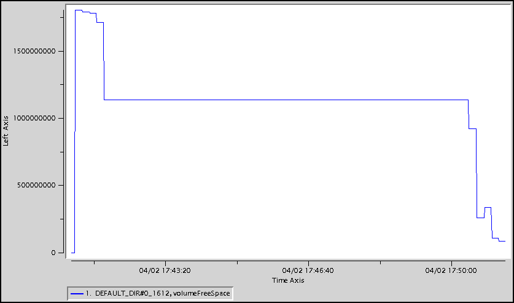

# Troubleshooting Disk Space
## Description
GemFire JVMs use disk in several ways, including:

* Logging and statistics
* Region persistence and overflow
* Gateway queue persistence and overflow
* Client queue overflow

In an active system, these files (especially the region persistence files) can use a lot of disk space.
## Determination
### Disk Store Monitor
The GemFire `Disk Store Monitor` runs in each JVM and monitors disk usage. See the GemFire documentation for additional details.

It logs a warning like below in the GemFire log file when the disk usage exceeds the usage threshold (default=80%).

	[warning 2015/04/02 17:20:11.300 PDT server2 <DiskStoreMonitor> tid=0x33] The disk volume . for disk store DEFAULT has exceeded the warning usage threshold and is 80% full

It throws errors and warnings like below when the disk usage exceeds the critical threshold (default=99%) and shuts down the JVM.

	[error 2015/04/02 16:29:12.051 PDT server1 <DiskStoreMonitor> tid=0x31] The disk volume . for disk store DEFAULT has exceeded the critical usage threshold and is 99% full
	
	[error 2015/04/02 16:29:12.581 PDT server1 <DiskStoreMonitor> tid=0x31] A DiskAccessException has occurred while writing to the disk for disk store DEFAULT. The cache will be closed.
	com.gemstone.gemfire.cache.DiskAccessException: For DiskStore: DEFAULT: Critical disk usage threshold exceeded for volume /path/to/server1/.: 99% full
	
	[warning 2015/04/02 16:29:22.590 PDT server1 <DiskStoreMonitor> tid=0x31] The disk volume /path/to/server1/. for log files has exceeded the warning usage threshold and is 99% full.

In conjunction with the `Disk Store Monitor` warnings and errors, an **IOException** with the message **Not enough space left on device** like below may also be thrown either by a GemFire thread or an application thread.

	[error 2015/04/02 16:29:33.502 PDT server1 <ServerConnection on port 41310 Thread 18> tid=0x66] A DiskAccessException has occurred while writing to the disk for region /__PR/_B__trades_68. The cache will be closed.
	com.gemstone.gemfire.internal.InsufficientDiskSpaceException: For DiskStore: DEFAULT: Could not pre-allocate file /path/to/server1/./BACKUPDEFAULT_2.crf with size=966,367,641, caused by java.io.IOException: Not enough space left on device
	...
	Caused by: java.io.IOException: Not enough space left on device
		at com.gemstone.gemfire.internal.shared.NativeCallsJNAImpl$POSIXNativeCalls.preBlow(NativeCallsJNAImpl.java:336)
		at com.gemstone.gemfire.internal.cache.Oplog.preblow(Oplog.java:1028)
###df
One way to see disk space usage of a given disk is to use the operating system `df` command like:

	df -h .
	Filesystem      Size  Used Avail Use% Mounted on
	/dev/sdb1        68G   63G  1.1G  99% /disk1
###vsd
Another way to determine whether there is a disk issue is to use `vsd` to display the disk free space values contained in a given GemFire statistics archive.
####VMStats
The chart below shows **DiskDirStats volumeFreeSpace** values. The **DiskDirStats volumeFreeSpace** values show the available usable space in the directory.
 In this case, the disk store ran out of disk space.

## Action
There are several actions that can help alleviate disk issues issues, including:

* Remove old GemFire log and statistics files
* Compact the GemFire region and queue persistence files
* Configure GemFire log and statistics rolling so earlier logs and statistics files are deleted
* Add additional disks for region and queue persistence and overflow

See the GemFire documentation for additional details on all of these actions.