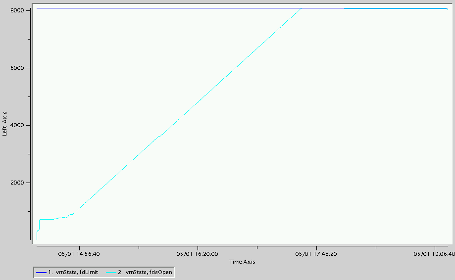
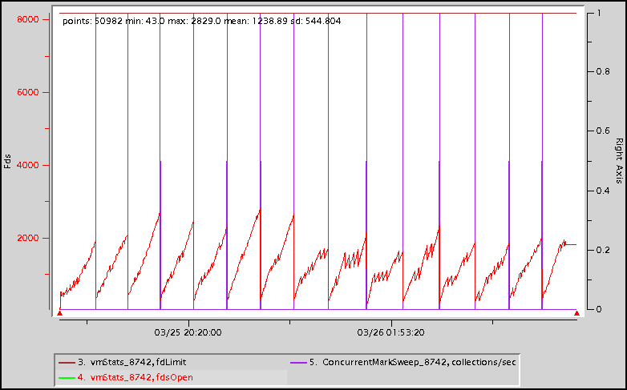

# Troubleshooting File Descriptors
## Description
JVMs use File Descriptors (FDs) to access files and sockets. Often, the default (1024) is not high enough to support a running GemFire JVM.
## Determination
A native memory issue will manifest itself in the GemFire log file as a **SocketException** with the message **Too many open files** thrown either by a GemFire thread or an application thread. An example of the exception is shown below.

	[info 2009/05/02 00:33:26.480 UTC  <RMI TCP Connection(83)-168.109.18.47> tid=0x100f]
	 Connection: failed to connect to peer server(12739):53311/47704 because: java.net.SocketException: Too many open files

###lsof
One way to determine whether there is an FD issue is to use the operating system `lsof` command to list open files including sockets of any running process including JVMs. These include:

* Java jar files
* GemFire stats and log files
* Established and listening TCP sockets
* UDP sockets

The example below shows a partial list of the open files for the JVM with pid 26896.

	lsof -p26896
	COMMAND   PID     USER   FD   TYPE             DEVICE SIZE/OFF     NODE NAME
	java    26896 user1  cwd    DIR               0,26     4096  7577811 /path/to/server1
	java    26896 user1  txt    REG               0,25     7718 12856054 /path/to/jre/bin/java
	java    26896 user1  mem    REG               0,25 62559453 12855938 /path/to/jre/lib/rt.jar
	java    26896 user1    5r   REG               0,25 13850425 43279281 /path/to/GemFire8.1.0/lib/gemfire.jar
	java    26896 user1    6r   REG               0,25   133531 43279230 /path/to/GemFire8.1.0/lib/log4j-api-2.1.jar
	java    26896 user1    7r   REG               0,25   824749 43279262 /path/to/GemFire8.1.0/lib/log4j-core-2.1.jar
	java    26896 user1   32r   REG               0,26    71085  7494566 /path/to/server1/cacheserver.log
	java    26896 user1   33w   REG               0,26    85549  7494568 /path/to/server1/cacheserver.gfs
	java    26896 user1   37r  IPv6           26751251      0t0      TCP host1:25940 (LISTEN)
	java    26896 user1   39r  IPv6           26751254      0t0      TCP host1:25940->host2:47695 (ESTABLISHED)
	java    26896 user1   40r  IPv6           26751256      0t0      UDP host1:15684 
	java    26896 user1   41r  IPv6           26751257      0t0      TCP host1:10429 (LISTEN)
	java    26896 user1   42r  IPv6           26751335      0t0      TCP host1:25940->host2:47713 (ESTABLISHED)
	java    26896 user1   43r  IPv6           26751272      0t0      TCP host1:25940->host2:47701 (ESTABLISHED)
	java    26896 user1   44r  IPv6           26751273      0t0      TCP host1:36938->host2:24980 (ESTABLISHED)
	java    26896 user1   49u  IPv6           26751283      0t0      TCP host1:10429->host2:47830 (ESTABLISHED)
	java    26896 user1   51u  IPv6           26751347      0t0      TCP host1:56087->host2:30937 (ESTABLISHED)
	java    26896 user1   53r  IPv6           26751373      0t0      TCP host1:56092->host2:30937 (ESTABLISHED)
	java    26896 user1   54u  IPv6           26751375      0t0      TCP host1:36951->host2:24980 (ESTABLISHED)
	java    26896 user1   55u  IPv6           26751377      0t0      TCP *:43514 (LISTEN)
	java    26896 user1   56r  IPv6           26751521      0t0      TCP host1:43514->host2:59930 (ESTABLISHED)
	java    26896 user1   57r  IPv6           26751565      0t0      TCP host1:43514->host2:59960 (ESTABLISHED)
	java    26896 user1   58u  IPv6           26751566      0t0      TCP host1:43514->host2:59962 (ESTABLISHED)
	java    26896 user1   59u  IPv6           26751579      0t0      TCP host1:43514->host2:59965 (ESTABLISHED)
	java    26896 user1   60u  IPv6           26751594      0t0      TCP host1:43514->host2:59966 (ESTABLISHED)
	java    26896 user1   61u  IPv6           26751600      0t0      TCP host1:43514->host2:59969 (ESTABLISHED)
	java    26896 user1   62u  IPv6           26751603      0t0      TCP host1:43514->host2:59971 (ESTABLISHED)
	java    26896 user1   63u  IPv6           26751605      0t0      TCP host1:43514->host2:59973 (ESTABLISHED)
	java    26896 user1   64u  IPv6           26751622      0t0      TCP host1:43514->host2:59975 (ESTABLISHED)
	java    26896 user1   65u  IPv6           26751623      0t0      TCP host1:43514->host2:59978 (ESTABLISHED)

The example below counts establsished TCP socket connections.

	lsof -p26896 | grep ESTABLISHED | wc
	     29     290    4037

###vsd
Another way to determine whether there is an FD issue is to use `vsd` to display the open and maximum FD values contained in a given GemFire statistics archive.
####VMStats
The chart below shows **VMStats fdLimit** and **fdsOpen** values. In this case, the application ran out of FDs.

The JVM will also maintain references to FDs for files and (mainly) sockets that have been closed until a GC cleans them up. This condition is referred to as a soft FD leak. It results in a saw-tooth pattern in the **VMStats fdsOpen** values. An example is shown in the chart below.

###gfsh
The `gfsh` **show metrics** command can be used to show the FD limit (**fileDescriptorLimit**) and number of open FDs (**totalFileDescriptorOpen**) of a member. An example is:

	show metrics --member=server1 --categories=jvm
	
	Member Metrics
	
	Category |         Metric          | Value
	-------- | ----------------------- | -----
	jvm      | jvmThreads              | 82
	         | fileDescriptorLimit     | 81920
	         | totalFileDescriptorOpen | 75
##Action
There are several actions that can help prevent FD issues, including:

* Increase the open files limit. Check your operating system for specifics on how to do this.
* Change the GemFire settings that control the life of connected sockets. For additional details, see <a href="https://communities.vmware.com/docs/DOC-23140" target="_blank">Managing Open File Descriptors on GemFire Data Node Hosts</a>.