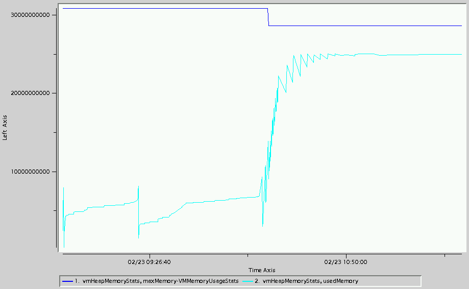
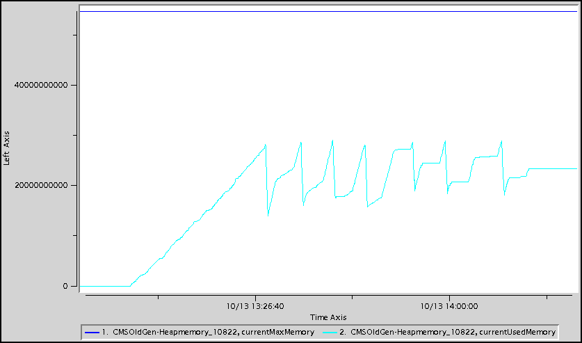
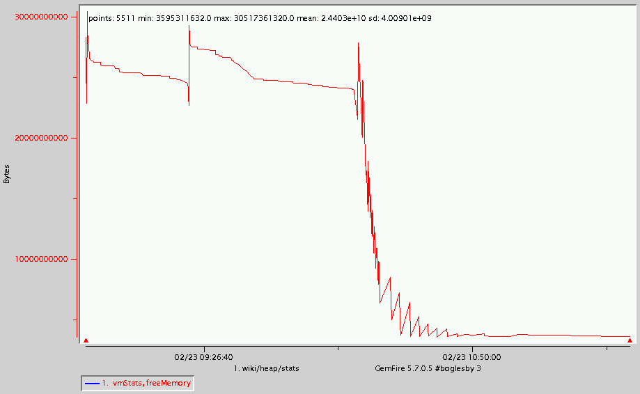

# Troubleshooting Heap
## Description
Java application VMs allocate objects on the heap. The heap includes both live and dead objects. It is configured using the -Xms and -Xmx VM arguments. When the heap becomes close to full, GCs occur which cause application pauses.
## Determination
One way to know that there is a heap memory issue is when an **OutOfMemoryError** with the message *'Java heap space'* is thrown either by GemFire or the application. The error must contain the *'Java heap space'* message and not the *'unable to create new native thread'* message (see [[Troubleshooting Native Memory]] for details on that issue). An example is shown below.

	[severe 2009/02/23 19:38:48.293 UTC <Gateway Event Processor> tid=0xbd] Uncaught exception in thread <Gateway Processor>
	 java.lang.OutOfMemoryError: Java heap space
###vsd
Another way to determine whether there is a heap memory issue is to use *vsd* to display free, used and maximum heap memory values contained in a given GemFire statistics archive. There are several categories that contain the used and maximum heap memory values. The most useful are the **VMMemoryUsageStats-vmHeapMemoryStats maxMemory** and **usedMemory** values, the **VMMemoryPoolStats-CMSOldGen-Heapmemory maxMemory** and **usedMemory** values and the **VMStats freeMemory** value.
####vmHeapMemoryStats
The chart below shows **VMMemoryUsageStats-vmHeapMemoryStats maxMemory** and **usedMemory** values.

####CMS Old Gen-Heap memory
The chart below shows **VMMemoryPoolStats-CMSOldGen-Heapmemory currentMaxMemory** and **currentUsedMemory** values.

####VMStats
The chart below shows the **VMStats freeMemory** values.

###gfsh
The *gfsh show metrics* command can be used to show the current (**currentHeapSize**) and maximum (**maximumHeapSize**) heap sizes of a member. An example is:
	show metrics --member=server1 --categories=member
	
	Member Metrics
	
	Category |     Metric      | Value
	-------- | --------------- | -----------------
	member   | upTime          | 1638
	         | cpuUsage        | 89.60260009765625
	         | currentHeapSize | 6800
	         | maximumHeapSize | 81250

##Action
There are several ways to eliminate a heap memory issue including:

* Increase the maximum amount of heap available to the VM using the *-Xmx* VM argument
* Configure one or more regions to overflow so that their values are not stored on the heap
* Scale the distributed system horizontally by adding one or more additional members
