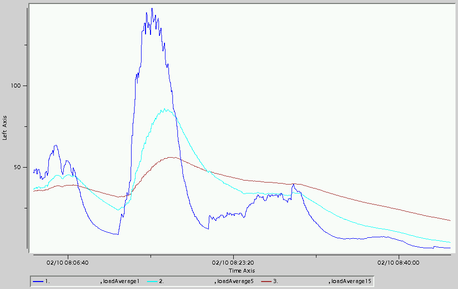

# Troubleshooting Load Average
## Description
Load average shows how many processes are waiting in the run queue for a system resource (usually a processor). The higher the load average, the more processes are waiting.
## Determination
One way to determine whether a machine has high load average is to use an operating system command such as uptime or top while the application is running.
### The uptime Command
The uptime output below shows that the load average is 0.40, 0.46, 0.43 over the last 1, 5 and 15 minutes, respectively.

	uptime
	15:37:27  up 107 days,  2:24, 32 users,  load average: 0.40, 0.46, 0.43

### vsd
Another way to determine whether a machine has high load average is to use *vsd* to display the load average values contained in a given GemFire statistics archive. The *LinuxSystemStats* category contains the *loadAverage1*, *loadAverage5* and *loadAverage15* values.

## Action
Determining that there is high load is one thing. Finding the source of the load is another (whether it be CPU or I/O). One operating system command that can help determine the cause of high load is top.

The top output shows, among other things, load average, CPU usage percentages and I/O wait (iowait) percentage. The iowait percentage is the percentage of time the CPU is waiting for an I/O to complete. The output below shows a fairly high load average over the past 1 minute (10.40) for the number of CPUs. It also shows that the CPUs are mostly in use (idle=3.0%) and that I/O wait percentage is low (0.4%).

	 12:49:24  up 113 days, 23:36, 35 users,  load average: 10.40, 5.20, 2.30
	 615 processes: 587 sleeping, 27 running, 1 zombie, 0 stopped
	 CPU states:  cpu    user    nice  system    irq  softirq  iowait    idle
	            total   61.7%    0.0%   31.4%   0.5%     2.5%    0.4%    3.0%
	 
	   PID USER  PRI  NI  SIZE  RSS SHARE STAT %CPU %MEM   TIME CPU COMMAND
	 22523 user1  15   0 1102M 1.1G 18068 R     3.6 14.1   0:24   1 java
	 22778 user1  15   0 1102M 1.1G 18068 R     2.1 14.1   0:02   1 java
	 22682 user1  15   0 1102M 1.1G 18068 R     1.4 14.1   0:07   1 java
	 22698 user1  15   0 1102M 1.1G 18068 R     1.4 14.1   0:10   0 java
	 19286 user1  15   0 1100M 1.1G 18080 R     0.5 14.1   0:25   0 java
 
In this case, the high load is due to CPU. See the Action section of the [[Troubleshooting CPU]] document for actions that can help alleviate CPU issues. If the I/O wait percentage was high, then the high load might be related to disk I/O. See the GemFire documentation for actions that can help alleviate disk issues for persistent regions.

