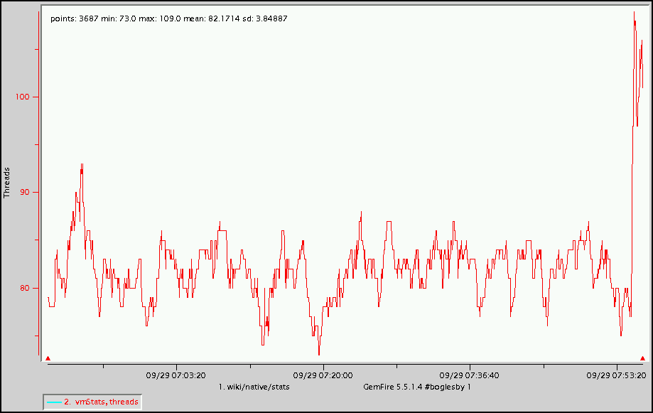
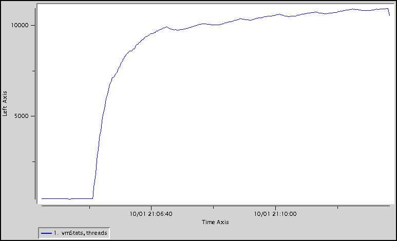
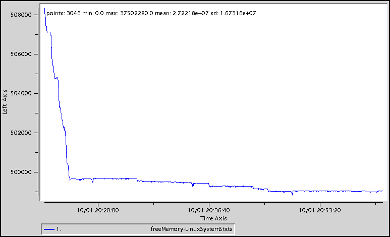
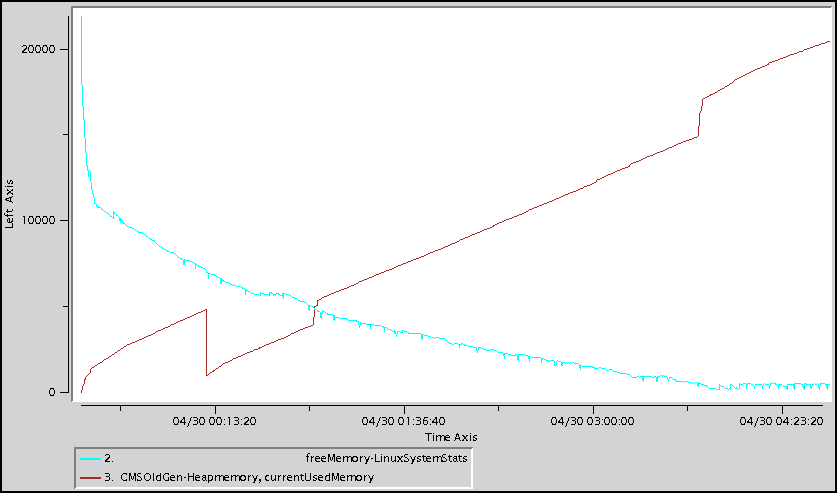

#Troubleshooting Native Memory
## Description
The available native memory on a machine is the difference between the machine's physical RAM and the memory used by the processes running on it. It is actually even less than that since the operating system also uses some of this memory.

JVMs allocate thread stacks in native memory not the JVM heap. An application can exhaust the native heap with thread allocations and still have plenty of JVM heap.

Native memory issues are generally caused by one of two things, namely

* allocating too many processes/threads for the available native memory
* configuring too low of a maximum for user processes

## Determination
One way to determine whether there is a native memory issue is to use an OS command such as *free* or *top* to see the available free memory. If the free memory looks ok, then use an OS command like *ulimit* to see the maximum user processes. 
###free
The *free* command shows the amount of free and used memory on the machine. The *free* output below shows ~48GB total memory with ~11GB used and ~37GB free.

	free -m
	             total       used       free     shared    buffers     cached
	Mem:         48251      11043      37208          0         13        616
	-/+ buffers/cache:      10413      37838
	Swap:        98303          0      98303

###top
The *top* command shows, among other things, the amount of free and used memory on the machine as well individual processes. The *top* output below is a different view of the *free* output. It below shows the same 48GB total memory with ~11GB used and ~37GB free. It also shows the JVM using most of that memory.

	Mem:  49409536k total, 11254756k used, 38154780k free,    13416k buffers
	 9024 user1     20   0 45.5g 9.4g  15m S  9.3 20.0   5:46.14 java               

###ulimit
The *ulimit* command shows the resource limits allowed to a user (like files and processes). The *ulimit* output below shows the soft limits.

	ulimit -Sa
	core file size          (blocks, -c) unlimited
	data seg size           (kbytes, -d) unlimited
	scheduling priority             (-e) 0
	file size               (blocks, -f) unlimited
	pending signals                 (-i) 63832
	max locked memory       (kbytes, -l) 8191296
	max memory size         (kbytes, -m) unlimited
	open files                      (-n) 8192
	pipe size            (512 bytes, -p) 8
	POSIX message queues     (bytes, -q) 819200
	real-time priority              (-r) 0
	stack size              (kbytes, -s) 10240
	cpu time               (seconds, -t) unlimited
	max user processes              (-u) 501408
	virtual memory          (kbytes, -v) unlimited
	file locks                      (-x) unlimited

The **max user processes** value is the one of interest for native memory issues.

In addition, you can see the limits for a specific running process in linux by *cat*ting the limits file for that process. The limits for the process with *pid* 7360 are shown below.

	cat /proc/7360/limits
	Limit                     Soft Limit           Hard Limit           Units     
	Max cpu time              unlimited            unlimited            seconds   
	Max file size             unlimited            unlimited            bytes     
	Max data size             unlimited            unlimited            bytes     
	Max stack size            10485760             unlimited            bytes     
	Max core file size        0                    unlimited            bytes     
	Max resident set          unlimited            unlimited            bytes     
	Max processes             1024                 385855               processes 
	Max open files            4096                 4096                 files     
	Max locked memory         65536                65536                bytes     
	Max address space         unlimited            unlimited            bytes     
	Max file locks            unlimited            unlimited            locks     
	Max pending signals       385855               385855               signals   
	Max msgqueue size         819200               819200               bytes     
	Max nice priority         0                    0                    
	Max realtime priority     0                    0                    
	Max realtime timeout      unlimited            unlimited            us        

The **Max processes** value is the one of interest for native memory issues.

A native memory issue will manifest as an **OutOfMemoryError** with the message *'unable to create new native thread'* thrown either by GemFire thread or an application thread. The error must contain the *'unable to create new native thread'* message and not the *'Java heap space'* message (see [[Troubleshooting Heap]] for details on that issue). An example of the error is shown below.

	[severe 2008/09/29 10:56:12.919 EDT <Message Dispatcher for 127.0.0.1:2879> tid=0x56f]
	 Uncaught exception in thread <Message Dispatcher for 127.0.0.1:2879>
	 Caused by: java.lang.OutOfMemoryError: unable to create new native thread
	         at java.lang.Thread.start0(Native Method)
	         at java.lang.Thread.start(Thread.java:597)
###vsd
Another way to check whether there is a native memory issue is to use *vsd* to display the free memory and number of threads contained in a given GemFire statistics archive. The **VMStats threads** statistic shows the number of threads in the JVM. The **LinuxSystemStats freeMemory** shows the available free memory in the OS.
####VMStats
The chart below shows healthy **VMStats threads** values.

The chart below shows potentially unhealthy **VMStats threads** values.

####LinuxSystemStats
The chart below shows healthy **LinuxSystemStats freeMemory** values.

The chart below shows unhealthy **LinuxSystemStats freeMemory** values. It also shows that the JVM heap is the source of the memory usage.

###gfsh
The *gfsh show metrics* command can be used to show the number of threads (*jvmThreads*) of a member. An example is:

	show metrics --member=server1 --categories=jvm
	
	Member Metrics
	
	Category |         Metric          | Value
	-------- | ----------------------- | -----
	jvm      | jvmThreads              | 82
	         | fileDescriptorLimit     | 81920
	         | totalFileDescriptorOpen | 75

##Action
There are several actions that can prevent native memory issues.

If there is not enough available RAM:

* Reducing the JVM's thread stack size. The -Xss JVM argument is used to determine the thread stack size. A thread stack size like -Xss256m or -Xss384m should be sufficient.
* Reduce the number of threads. See [[Troubleshooting CPU]] for additional details.
* Reduce the max heap size of the JVM using -Xmx. This will provide a greater difference between the RAM and the heap and thus more native memory.
* Add RAM to the machine

If the maximum for user processes is too low:

* Increase the maximum number of user processes. Check your OS for specifics on how to do this.