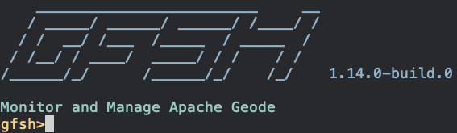

# Apache Geode APIs Compatible with Redis

[Introduction](#introduction)  
[How To Try It](#how-to-try-it)  
[Building Apache Geode](#building-apache-geode)  
[Starting a Geode Server with Redis Enabled](#starting-a-server)  
[Adding an Additional Geode Server Compatible with Redis](#adding-a-server)  
[Shutting Down](#shutting-down)  
[Redis Commands](#redis-commands)


## <a name="introduction"></a>Introduction

The Geode APIs compatible with Redis allows an application to send Redis commands to Geode. This will allow users to 
switch seamlessly from native Redis to Geode as a data store/caching solution. 

The API allows Geode to listen for and interpret incoming Redis commands on a designated port.

## <a name="how-to-try-it"></a>How To Try It

The Geode APIs compatible with Redis is currently in early access. We’ll build the develop branch of Apache Geode
and then connect the [Redis-CLI](https://redis.io/topics/quickstart) to that instance.

**Note:** Currently Geode requires **Java 8 JDK** to build.

### <a name="building-apache-geode"></a>Supported Redis Commands

Not all Redis commands are currently supported. The current set of supported Redis commands is listed [here](#redis-command-status).

### <a name="building-apache-geode"></a>Building Apache Geode
The Apache Geode source code can be found here

1. In a terminal, git clone the Geode repo:
    ```commandline
    $ git clone https://github.com/apache/geode.git
    ```

2. Change the working directory to the Geode directory you cloned
	```commandline
	$ cd geode
    ```

3. Build the Geode application without running the test (REQUIRES JAVA 8)
    ```commandline
    $ ./gradlew assemble
   ```

4. Once the build has completed, navigate to the geode-assembly directory which contains the Apache 
    Geode Shell - also referred to as GFSH:
    ```commandline
    $ cd geode-assembly/build/install/apache-geode/bin
   ```

5. Once in that folder run the following command:
    ```commandline
   $ ./gfsh
   ```

You should now see GFSH starting up with a version of 1.14.x.-build.x



### <a name="starting-a-server"></a>Starting a Geode Server with Redis Enabled
**Note**: if you wish to run the Geode APIs compatible with Redis on the default Redis port (6379), make sure to stop
any applications running on that port before starting the Geode server, especially any native Redis
servers.

Using GFSH enter the following commands:

1. Start a locator. The locator tracks servers and server load. When a client requests a server 
connection, the locator directs the client to one of the least loaded servers.
[Learn more](https://geode.apache.org/docs/guide/12/configuring/running/running_the_locator.html). 
   ```commandline
    gfsh> start locator
    ``` 

2. After the locator has started, start a server that will be able to handle incoming Redis commands. 

    For example:
    ```commandline
    gfsh> start server --name=redisServer1 --locators=localhost[10334] --server-port=0 --compatible-with-redis-port=6379
    ```
    * --name: A name you create for your server.
    * --locators: This is the location of the locator you started in step 1. 
    * --server-port: The port that Geode clients connect to.
    * --compatible-with-redis-port: The port that your Redis client will connect to.

    Your Geode instance should now be up and running (1 locator and 1 server) and ready to accept Redis 
    commands.  

    **Keep this terminal open and running so that you can easily shutdown the Geode instance when you are 
    done working locally.**

3. To confirm that things are running correctly, in a separate terminal run:
      ```commandline
    $ redis-cli
      ```
    If working correctly you should now be in the redis-cli and see `127.0.0.1:6379>`.  If you run the 
    `PING` command you should receive a response of `PONG`.

### <a name="adding-a-server"></a>Optional - Adding an Additional Geode server compatible with Redis
If you’re interested in testing Geode scalability, in GFSH run the start server command again BUT 
make sure you change the `--name=` and `--redis-port=` parameters. 

For example: 
   ```commandLine
   $ start server --name=redisServer2 --locators=localhost[10334] --server-port=0 --compatible-with-redis-port=6380
   ```

### <a name="shutting-down"></a>Shutting Down 
To shutdown the Geode instance you started, in the terminal with GFSH running type the following command

   ```commandLine
$ shutdown --include-locators=true
   ```
	
As this command will shut down the entire Geode instance/cluster, you will be prompted with the following choice: 

```commandline
As a lot of data in memory will be lost, including possibly events in queues, do you really want to shutdown the entire distributed system? (Y/n)
```

To confirm that everything shutdown correctly, if you execute a Redis command in the redis-cli you should see the following message:

```commandline
Could not connect to Redis at 127.0.0.1:6379: Connection refused 
not connected>
```
### <a name="redis-commands"></a>Redis Commands

The Geode APIs compatible with Redis currently implements a subset of the full Redis command set. Some commands
are **unsupported** (see table below). Unsupported commands are available to use, but have not been
fully tested. There is no guarantee they will work exactly as expected.

#### <a name="enable-unsupported-commands"></a>Enabling Unsupported Commands

If you already have Geode servers running with Redis enabled, you can execute the following
command with gfsh to enable unsupported commands:

```pre
redis --enable-unsupported-commands
```

You can also enable unsupported commands when you start the Geode server by setting the Java property `enable-redis-unsupported-commands=true`:

```pre
start server \
  --J=-Denable-redis-unsupported-commands=true \
  --name=<serverName> \
  --locators=<locatorPort> \
  --compatible-with-redis-port=<redisPort> \
  --compatible-with-redis-bind-address=<redisBindAddress> \
  --compatible-with-redis-password=<redisPassword>
```

#### <a name="redis-command-status"></a>Redis Command Status [Return to top](#introduction)

| Supported Commands 	| Unsupported Commands<br>(Implemented - not tested) 	|    Commands Not Implemented   	|
|-----------------------|-------------------------------------------------------|-----------------------------------|
| APPEND             	| BITCOUNT                                           	| ACL CAT                       	|
| AUTH               	| BITOP                                              	| ACL DELUSER                   	|
| DECRBY              	| BITPOS                                             	| ACL GENPASS                   	|
| DEL                	| DBSIZE                                             	| ACL GETUSER                   	|
| EXISTS             	| DECR                                               	| ACL HELP                      	|
| EXPIRE             	| ECHO                                                	| ACL LIST                      	|
| EXPIREAT           	| FLUSHALL                                           	| ACL LOAD                      	|
| GET                	| FLUSHDB                                            	| ACL LOG                       	|
| HGETALL      	        | GETBIT                                             	| ACL SAVE                      	|
| HMGET             	| GETRANGE                                           	| ACL SETUSER                   	|
| HMSET              	| GETSET                                             	| ACL USERS                     	|
| HSET                 	| HDEL                                               	| ACL WHOAMI                    	|
| HSETNX             	| HEXISTS                                            	| BGREWRITEAOF                  	|
| HSTRLEN              	| HGET                                               	| BGSAVE                        	|
| HLEN               	| HINCRBY                                            	| BITFIELD                      	|
| HVALS               	| HINCRBYFLOAT                                       	| BLPOP                         	|
| INFO               	| HKEYS                                              	| BRPOP                         	|
| KEYS               	| HSCAN[3]                                             	| BRPOPLPUSH                    	|
| PERSIST            	| INCR                                                  | BZPOPMAX                      	|
| PEXPIRE            	| INCRBY                                                | BZPOPMIN                      	|
| PEXPIREAT          	| INCRBYFLOAT                                           | CLIENT CACHING                	|
| PING               	| MGET                                                  | CLIENT GETNAME                	|
| PSUBSCRIBE         	| MSET                                                 	| CLIENT ID                     	|
| PTTL               	| MSETNX                                             	| CLIENT KILL                   	|
| PUNSUBSCRIBE       	| PSETEX                                             	| CLIENT LIST                   	|
| QUIT               	| SCAN                                              	| CLIENT PAUSE                  	|
| RENAME             	| SCARD                                                 | CLIENT REPLY                  	|
| SADD              	| SDIFF                                              	| CLIENT SETNAME                	|
| SET                   | SDIFFSTORE                                         	| CLIENT TRACKING               	|
| SLOWLOG[2]            | SELECT                                             	| CLIENT UNBLOCK                	|
| SMEMBERS              | SETBIT                                             	| CLUSTER ADDSLOTS              	|
| SREM                  | SETEX                                              	| CLUSTER BUMPEPOCH             	|
| SUBSCRIBE             | SETNX                                              	| CLUSTER COUNT-FAILURE-REPORTS 	|
| TTL                   | SETRANGE                                           	| CLUSTER COUNTKEYSINSLOT       	|
| TYPE                 	| SHUTDOWN                                           	| CLUSTER DELSLOTS     	            |
| UNSUBSCRIBE           | SINTER                                             	| CLUSTER FAILOVER              	|
| PUBLISH               | SINTERSTORE                                        	| CLUSTER FLUSHSLOTS                |
|                    	| SISMEMBER                                          	| CLUSTER FORGET                    |
|                    	| SLOWLOG                                            	| CLUSTER GETKEYSINSLOT             |
|                    	| SMOVE                                              	| CLUSTER INFO                  	|
|                    	| SPOP                                               	| CLUSTER KEYSLOT                   |
|                    	| SRANDMEMBER                                        	| CLUSTER MEET                      |
|                    	| SSCAN                                              	| CLUSTER MYID                   	|
|                    	| STRLEN                                             	| CLUSTER NODES                 	|
|                    	| SUNION                                             	| CLUSTER REPLICAS                  |
|                    	| SUNIONSTORE                                        	| CLUSTER REPLICATE              	|
|                    	| TIME                                               	| CLUSTER RESET                  	|
|                    	| UNLINK [1]                                         	| CLUSTER SAVECONFIG                |
|                    	|                                      	                | CLUSTER SET-CONFIG-EPOCH          |
|                    	|                                       	            | CLUSTER SETSLOT                   |
|                   	|                                               	    | CLIENT GETREDIR               	|
|                    	|                                      	                | CLUSTER SLAVES                    |
|                    	|                                      	                | CLUSTER SLOTS                 	|
|                    	|                                                       | COMMAND                       	|
|                    	|                                             	        | COMMAND COUNT                 	|
|                    	|                                                    	| COMMAND GETKEYS               	|
|                    	|                                                    	| COMMAND INFO                  	|
|                    	|                                                    	| CONFIG GET                    	|
|                    	|                                                    	| CONFIG RESETSTAT              	|
|                    	|                                                    	| CONFIG REWRITE                	|
|                    	|                                                    	| CONFIG SET                    	|
|                    	|                                                    	| DEBUG OBJECT                  	|
|                    	|                                                    	| DEBUG SEGFAULT                	|
|                    	|                                                    	| DISCARD                       	|
|                    	|                                                    	| DUMP                          	|
|                    	|                                                    	| EVAL                          	|
|                    	|                                                    	| EVALSHA                       	|
|                    	|                                                    	| EXEC                          	|
|                    	|                                                    	| GEOADD                        	|
|                    	|                                                    	| GEODIST                       	|
|                    	|                                                    	| GEOHASH                       	|
|                    	|                                                    	| GEOPOS                        	|
|                    	|                                                    	| GEORADIUS                     	|
|                    	|                                                    	| GEORADIUSBYMEMBER             	|
|                    	|                                                    	| LASTSAVE                      	|
|                    	|                                                    	| LATENCY DOCTOR                	|
|                    	|                                                    	| LATENCY GRAPH                 	|
|                    	|                                                    	| LATENCY HELP                  	|
|                    	|                                                    	| LATENCY HISTORY               	|
|                    	|                                                    	| LATENCY LATEST                	|
|                    	|                                                    	| LATENCY RESET                 	|
|                    	|                                                    	| LINDEX                        	|
|                    	|                                                    	| LINSERT                       	|
|                    	|                                                    	| LLEN                          	|
|                    	|                                                    	| LOLWUT                        	|
|                    	|                                                    	| LPOP                          	|
|                    	|                                                    	| LPOS                          	|
|                    	|                                                    	| LPUSH                         	|
|                    	|                                                    	| LPUSHX                        	|
|                    	|                                                    	| LRANGE                        	|
|                    	|                                                    	| LREM                          	|
|                    	|                                                    	| LSET                          	|
|                    	|                                                    	| LTRIM                         	|
|                    	|                                                    	| MEMORY DOCTOR                 	|
|                    	|                                                    	| MEMORY HELP                   	|
|                    	|                                                    	| MEMORY MALLOC-STATS           	|
|                    	|                                                    	| MEMORY PURGE                  	|
|                    	|                                                    	| MEMORY STATS                  	|
|                    	|                                                    	| MEMORY USAGE                  	|
|                    	|                                                    	| MIGRATE                       	|
|                    	|                                                    	| MODULE LIST                   	|
|                    	|                                                    	| MODULE LOAD                   	|
|                    	|                                                    	| MODULE UNLOAD                 	|
|                    	|                                                    	| MONITOR                       	|
|                    	|                                                    	| MOVE                          	|
|                    	|                                                    	| MULTI                         	|
|                    	|                                                    	| OBJECT                        	|
|                    	|                                                    	| PFADD                         	|
|                    	|                                                    	| PFCOUNT                       	|
|                    	|                                                    	| PFMERGE                       	|
|                    	|                                                    	| PSYNC                         	|
|                    	|                                                    	| PUBSUB                        	|
|                    	|                                                    	| RANDOMKEY                     	|
|                    	|                                                    	| READONLY                      	|
|                    	|                                                    	| READWRITE                     	|
|                    	|                                                    	| RENAMENX                      	|
|                    	|                                                    	| REPLICAOF                     	|
|                    	|                                                    	| RESTORE                       	|
|                    	|                                                    	| ROLE                          	|
|                    	|                                                    	| RPOP                          	|
|                    	|                                                    	| RPOPLPUSH                     	|
|                    	|                                                    	| RPUSH                         	|
|                    	|                                                    	| RPUSHX                        	|
|                    	|                                                    	| SAVE                          	|
|                    	|                                                    	| SCRIPT DEBUG                  	|
|                    	|                                                    	| SCRIPT EXISTS                 	|
|                    	|                                                    	| SCRIPT FLUSH                  	|
|                    	|                                                    	| SCRIPT KILL                   	|
|                    	|                                                    	| SCRIPT LOAD                   	|
|                    	|                                                    	| SLAVEOF                       	|
|                    	|                                                    	| SORT                          	|
|                    	|                                                    	| STRALGO LCS                   	|
|                    	|                                                    	| SWAPDB                        	|
|                    	|                                                    	| SYNC                          	|
|                    	|                                                    	| TOUCH                         	|
|                    	|                                                    	| UNWATCH                        	|
|                    	|                                                    	| WAIT                          	|
|                    	|                                                    	| WATCH                         	|
|                    	|                                                    	| XACK                          	|
|                    	|                                                    	| XADD                          	|
|                    	|                                                    	| XCLAIM                        	|
|                    	|                                                    	| XDEL                          	|
|                    	|                                                    	| XGROUP                        	|
|                    	|                                                    	| XINFO                         	|
|                    	|                                                    	| XLEN                          	|
|                    	|                                                    	| XPENDING                      	|
|                    	|                                                    	| XRANGE                        	|
|                    	|                                                    	| XREAD                         	|
|                    	|                                                    	| XREADGROUP GROUP              	|
|                    	|                                                    	| XREVRANGE                     	|
|                    	|                                                    	| XTRIM                         	|
|                    	|                                                    	| ZADD                          	|
|                    	|                                                    	| ZCARD                         	|
|                    	|                                                    	| ZCOUNT                        	|
|                    	|                                                    	| ZINCRBY                       	|
|                    	|                                                    	| ZINTERSTORE                   	|
|                    	|                                                    	| ZLEXCOUNT                     	|
|                    	|                                                    	| ZPOPMAX                       	|
|                    	|                                                    	| ZPOPMIN                       	|
|                    	|                                                    	| ZRANGE                        	|
|                    	|                                                    	| ZRANGEBYLEX                   	|
|                    	|                                                    	| ZRANGEBYSCORE                 	|
|                    	|                                                    	| ZRANK                         	|
|                    	|                                                    	| ZREM                          	|
|                    	|                                                    	| ZREMRANGEBYLEX                	|
|                    	|                                                    	| ZREMRANGEBYRANK               	|
|                    	|                                                    	| ZREMRANGEBYSCORE              	|
|                    	|                                                    	| ZREVRANGE                     	|
|                    	|                                                    	| ZREVRANGEBYSCORE              	|
|                    	|                                                    	| ZREVRANK                      	|
|                    	|                                                    	| ZSCAN                         	|
|                    	|                                                    	| ZSCORE                        	|
|                    	|                                                    	| ZUNIONSTORE                   	|

**NOTES:**

[1] - UNLINK is implemented as a synonym to DEL and does not unlink asynchronously.
[2] - SLOWLOG is implemented as a NoOp.
[3] - Redis accepts Longs as the cursor index for the HSCAN command. The Geode APIs compatible with Redis only accept Integer values. Values out of the range of the 32-bit integer type will throw a NumberFormatException with a message containing "invalid cursor".
