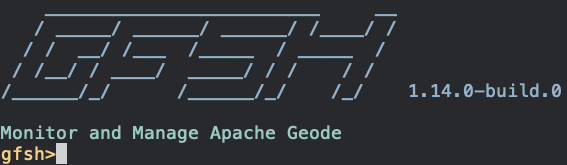

# Redis API for Apache Geode

[Introduction](#introduction)  
[How To Try It](#how-to-try-it)  
[Building Apache Geode](#building-apache-geode)  
[Starting a Geode Server with Redis Enabled](#starting-a-server)  
[Adding an Additional Geode Redis Server](#adding-a-server)  
[Shutting Down](#shutting-down)  
[Redis Commands](#redis-commands)  

## <a name="introduction"></a>Introduction

The Redis API for Geode allow an application to send Redis commands to Geode. This will allow users to 
switch seamlessly from native Redis to Geode as a data store/caching solution. 

The API allows Geode to listen for and interpret incoming Redis commands on a designated port.  The 
current set of supported Redis commands are listed [here](#redis-commands). 

## <a name="how-to-try-it"></a>How To Try It

We’ll build the develop branch of Apache Geode and then connect the [Redis-CLI](https://redis.io/topics/quickstart) to that instance.

### <a name="building-apache-geode"></a>Building Apache Geode
The Apache Geode source code can be found here

1. In a terminal, git clone the Geode repo:
    ```commandline
    $ git clone https://github.com/apache/geode.git
    ```

2. Change the working directory to the Geode directory you cloned
	```commandline
	$ cd geode
    ```

3. Build the Geode application without running the test (REQUIRES JAVA 8)
    ```commandline
    $ ./gradlew build -x test
   ```

4. Once the build has completed, navigate to the geode-assembly directory which contains the Apache 
    Geode Shell - also referred to as GFSH:
    ```commandline
    $ cd geode-assembly/build/install/apache-geode/bin
   ```

5. Once in that folder run the following command:
    ```commandline
   $ ./gfsh
   ```

You should now see GFSH starting up with a version of 1.14.x.-build.x



### <a name="starting-a-server"></a>Starting a Geode Server with Redis Enabled
Using GFSH enter the following commands:

1. Start a locator. The locator tracks servers and server load. When a client requests a server 
connection, the locator directs the client to one of the least loaded servers. Learn more. 
   ```commandline
    gfsh> start locator
    ``` 

2. After the locator has started, start a server that will be able to handle incoming Redis commands. 

    For example:
    ```commandline
    gfsh> start server --name=redisServer1 --locators=localhost[10334] --server-port=0 --redis-port=6379
    ```
    * --name: A name you create for your server.
    * --locators: This is the location of the locator you started in step 1. 
    * --server-port: The port that Geode clients connect to.
    * --redis-port: The port that your Redis client will connect to.

    Your Geode instance should now be up and running (1 locator and 1 server) and ready to accept Redis 
    commands.  

    **Keep this terminal open and running so that you can easily shutdown the Geode instance when you are 
    done working locally.**

3. To confirm that things are running correctly, in a separate terminal run:
      ```commandline
    $ redis-cli
      ```
    If working correctly you should now be in the redis-cli and see `127.0.0.1:6379>`.  If you run the 
    `PING` command you should receive a response of `PONG`.

### <a name="adding-a-server"></a>Adding an Additional Geode Redis Server 
If you’re interested in testing Geode scalability, in GFSH run the start server command again BUT 
make sure you change the `--name=` and `--redis-port=` parameters. 

For example: 
   ```commandLine
   $ start server --name=redisServer2 --locators=localhost[10334] --server-port=0 --redis-port=6380
   ```

### <a name="shutting-down"></a>Shutting Down 
To shutdown the Geode instance you started, in the terminal with GFSH running type the following command

   ```commandLine
$ shutdown --include-locators=true
   ```
	
As this command will shut down the entire Geode instance/cluster, you will be prompted with the following choice: 

```commandline
As a lot of data in memory will be lost, including possibly events in queues, do you really want to shutdown the entire distributed system? (Y/n)
```

To confirm that everything shutdown correctly, if you try and execute a Redis command in the redis-cli you should see the following message:

```commandline
Could not connect to Redis at 127.0.0.1:6379: Connection refused 
not connected>
```
### <a name="redis-commands"></a>Redis Commands

| Supported Commands 	| Unsupported Commands<br>(Implemented - not tested) 	|    Commands Not Implemented   	|
|-----------------------|-------------------------------------------------------|-----------------------------------|
| APPEND             	| BITCOUNT                                           	| ACL CAT                       	|
| AUTH               	| BITOP                                              	| ACL DELUSER                   	|
| DEL                	| BITPOS                                             	| ACL GENPASS                   	|
| EXISTS             	| DBSIZE                                             	| ACL GETUSER                   	|
| EXPIRE             	| DECR                                               	| ACL HELP                      	|
| EXPIREAT           	| DECRBY                                             	| ACL LIST                      	|
| GET                	| ECHO                                               	| ACL LOAD                      	|
| HGETALL            	| FLUSHALL                                           	| ACL LOG                       	|
| HMSET              	| FLUSHDB                                            	| ACL SAVE                      	|
| HSET               	| GETBIT                                             	| ACL SETUSER                   	|
| KEYS               	| GETRANGE                                           	| ACL USERS                     	|
| PERSIST            	| GETSET                                             	| ACL WHOAMI                    	|
| PEXPIRE            	| HDEL                                               	| BGREWRITEAOF                  	|
| PEXPIREAT          	| HEXISTS                                            	| BGSAVE                        	|
| PING               	| HGET                                               	| BITFIELD                      	|
| PSUBSCRIBE         	| HINCRBY                                            	| BLPOP                         	|
| PTTL               	| HINCRBYFLOAT                                       	| BRPOP                         	|
| PUBLISH            	| HKEYS                                              	| BRPOPLPUSH                    	|
| PUNSUBSCRIBE       	| HLEN                                               	| BZPOPMAX                      	|
| QUIT               	| HMGET                                              	| BZPOPMIN                      	|
| RENAME             	| HSCAN                                              	| CLIENT CACHING                	|
| SADD               	| HSETNX                                             	| CLIENT GETNAME                	|
| SET                	| HVALS                                              	| CLIENT GETREDIR               	|
| SMEMBERS           	| INCR                                               	| CLIENT ID                     	|
| SREM               	| INCRBY                                             	| CLIENT KILL                   	|
| SUBSCRIBE          	| INCRBYFLOAT                                        	| CLIENT LIST                   	|
| TTL                	| MGET                                               	| CLIENT PAUSE                  	|
| TYPE               	| MSET                                               	| CLIENT REPLY                  	|
| UNSUBSCRIBE        	| MSETNX                                             	| CLIENT SETNAME                	|
|                    	| PSETEX                                             	| CLIENT TRACKING               	|
|                    	| SCAN                                               	| CLIENT UNBLOCK                	|
|                    	| SCARD                                              	| CLUSTER ADDSLOTS              	|
|                    	| SDIFF                                              	| CLUSTER BUMPEPOCH             	|
|                    	| SDIFFSTORE                                         	| CLUSTER COUNT-FAILURE-REPORTS 	|
|                    	| SETBIT                                             	| CLUSTER COUNTKEYSINSLOT       	|
|                    	| SETEX                                              	| CLUSTER DELSLOTS              	|
|                    	| SETNX                                              	| CLUSTER FAILOVER              	|
|                    	| SETRANGE                                           	| CLUSTER FLUSHSLOTS            	|
|                    	| SHUTDOWN                                           	| CLUSTER FORGET                	|
|                    	| SINTER                                             	| CLUSTER GETKEYSINSLOT         	|
|                    	| SINTERSTORE                                        	| CLUSTER INFO                  	|
|                    	| SISMEMBER                                          	| CLUSTER KEYSLOT               	|
|                    	| SMOVE                                              	| CLUSTER MEET                  	|
|                    	| SPOP                                               	| CLUSTER MYID                  	|
|                    	| SRANDMEMBER                                        	| CLUSTER NODES                 	|
|                    	| SSCAN                                              	| CLUSTER REPLICAS              	|
|                    	| STRLEN                                             	| CLUSTER REPLICATE             	|
|                    	| SUNION                                             	| CLUSTER RESET                 	|
|                    	| SUNIONSTORE                                        	| CLUSTER SAVECONFIG            	|
|                    	| TIME                                               	| CLUSTER SET-CONFIG-EPOCH      	|
|                    	|                                                    	| CLUSTER SETSLOT               	|
|                    	|                                                    	| CLUSTER SLAVES                	|
|                    	|                                                    	| CLUSTER SLOTS                 	|
|                    	|                                                    	| COMMAND                       	|
|                    	|                                                    	| COMMAND COUNT                 	|
|                    	|                                                    	| COMMAND GETKEYS               	|
|                    	|                                                    	| COMMAND INFO                  	|
|                    	|                                                    	| CONFIG GET                    	|
|                    	|                                                    	| CONFIG RESETSTAT              	|
|                    	|                                                    	| CONFIG REWRITE                	|
|                    	|                                                    	| CONFIG SET                    	|
|                    	|                                                    	| DEBUG OBJECT                  	|
|                    	|                                                    	| DEBUG SEGFAULT                	|
|                    	|                                                    	| DISCARD                       	|
|                    	|                                                    	| DUMP                          	|
|                    	|                                                    	| EVAL                          	|
|                    	|                                                    	| EVALSHA                       	|
|                    	|                                                    	| EXEC                          	|
|                    	|                                                    	| GEOADD                        	|
|                    	|                                                    	| GEODIST                       	|
|                    	|                                                    	| GEOHASH                       	|
|                    	|                                                    	| GEOPOS                        	|
|                    	|                                                    	| GEORADIUS                     	|
|                    	|                                                    	| GEORADIUSBYMEMBER             	|
|                    	|                                                    	| HELLO                         	|
|                    	|                                                    	| HSTRLEN                       	|
|                    	|                                                    	| INFO                          	|
|                    	|                                                    	| LASTSAVE                      	|
|                    	|                                                    	| LATENCY DOCTOR                	|
|                    	|                                                    	| LATENCY GRAPH                 	|
|                    	|                                                    	| LATENCY HELP                  	|
|                    	|                                                    	| LATENCY HISTORY               	|
|                    	|                                                    	| LATENCY LATEST                	|
|                    	|                                                    	| LATENCY RESET                 	|
|                    	|                                                    	| LINDEX                        	|
|                    	|                                                    	| LINSERT                       	|
|                    	|                                                    	| LLEN                          	|
|                    	|                                                    	| LOLWUT                        	|
|                    	|                                                    	| LPOP                          	|
|                    	|                                                    	| LPOS                          	|
|                    	|                                                    	| LPUSH                         	|
|                    	|                                                    	| LPUSHX                        	|
|                    	|                                                    	| LRANGE                        	|
|                    	|                                                    	| LREM                          	|
|                    	|                                                    	| LSET                          	|
|                    	|                                                    	| LTRIM                         	|
|                    	|                                                    	| MEMORY DOCTOR                 	|
|                    	|                                                    	| MEMORY HELP                   	|
|                    	|                                                    	| MEMORY MALLOC-STATS           	|
|                    	|                                                    	| MEMORY PURGE                  	|
|                    	|                                                    	| MEMORY STATS                  	|
|                    	|                                                    	| MEMORY USAGE                  	|
|                    	|                                                    	| MIGRATE                       	|
|                    	|                                                    	| MODULE LIST                   	|
|                    	|                                                    	| MODULE LOAD                   	|
|                    	|                                                    	| MODULE UNLOAD                 	|
|                    	|                                                    	| MONITOR                       	|
|                    	|                                                    	| MOVE                          	|
|                    	|                                                    	| MULTI                         	|
|                    	|                                                    	| OBJECT                        	|
|                    	|                                                    	| PFADD                         	|
|                    	|                                                    	| PFCOUNT                       	|
|                    	|                                                    	| PFMERGE                       	|
|                    	|                                                    	| PSYNC                         	|
|                    	|                                                    	| PUBSUB                        	|
|                    	|                                                    	| RANDOMKEY                     	|
|                    	|                                                    	| READONLY                      	|
|                    	|                                                    	| READWRITE                     	|
|                    	|                                                    	| RENAMENX                      	|
|                    	|                                                    	| REPLICAOF                     	|
|                    	|                                                    	| RESTORE                       	|
|                    	|                                                    	| ROLE                          	|
|                    	|                                                    	| RPOP                          	|
|                    	|                                                    	| RPOPLPUSH                     	|
|                    	|                                                    	| RPUSH                         	|
|                    	|                                                    	| RPUSHX                        	|
|                    	|                                                    	| SAVE                          	|
|                    	|                                                    	| SCRIPT DEBUG                  	|
|                    	|                                                    	| SCRIPT EXISTS                 	|
|                    	|                                                    	| SCRIPT FLUSH                  	|
|                    	|                                                    	| SCRIPT KILL                   	|
|                    	|                                                    	| SCRIPT LOAD                   	|
|                    	|                                                    	| SELECT                        	|
|                    	|                                                    	| SLAVEOF                       	|
|                    	|                                                    	| SLOWLOG                       	|
|                    	|                                                    	| SORT                          	|
|                    	|                                                    	| STRALGO LCS                   	|
|                    	|                                                    	| SWAPDB                        	|
|                    	|                                                    	| SYNC                          	|
|                    	|                                                    	| TOUCH                         	|
|                    	|                                                    	| UNLINK                        	|
|                    	|                                                    	| UNWATCH                       	|
|                    	|                                                    	| WAIT                          	|
|                    	|                                                    	| WATCH                         	|
|                    	|                                                    	| XACK                          	|
|                    	|                                                    	| XADD                          	|
|                    	|                                                    	| XCLAIM                        	|
|                    	|                                                    	| XDEL                          	|
|                    	|                                                    	| XGROUP                        	|
|                    	|                                                    	| XINFO                         	|
|                    	|                                                    	| XLEN                          	|
|                    	|                                                    	| XPENDING                      	|
|                    	|                                                    	| XRANGE                        	|
|                    	|                                                    	| XREAD                         	|
|                    	|                                                    	| XREADGROUP GROUP              	|
|                    	|                                                    	| XREVRANGE                     	|
|                    	|                                                    	| XTRIM                         	|
|                    	|                                                    	| ZADD                          	|
|                    	|                                                    	| ZCARD                         	|
|                    	|                                                    	| ZCOUNT                        	|
|                    	|                                                    	| ZINCRBY                       	|
|                    	|                                                    	| ZINTERSTORE                   	|
|                    	|                                                    	| ZLEXCOUNT                     	|
|                    	|                                                    	| ZPOPMAX                       	|
|                    	|                                                    	| ZPOPMIN                       	|
|                    	|                                                    	| ZRANGE                        	|
|                    	|                                                    	| ZRANGEBYLEX                   	|
|                    	|                                                    	| ZRANGEBYSCORE                 	|
|                    	|                                                    	| ZRANK                         	|
|                    	|                                                    	| ZREM                          	|
|                    	|                                                    	| ZREMRANGEBYLEX                	|
|                    	|                                                    	| ZREMRANGEBYRANK               	|
|                    	|                                                    	| ZREMRANGEBYSCORE              	|
|                    	|                                                    	| ZREVRANGE                     	|
|                    	|                                                    	| ZREVRANGEBYSCORE              	|
|                    	|                                                    	| ZREVRANK                      	|
|                    	|                                                    	| ZSCAN                         	|
|                    	|                                                    	| ZSCORE                        	|
|                    	|                                                    	| ZUNIONSTORE                   	|
